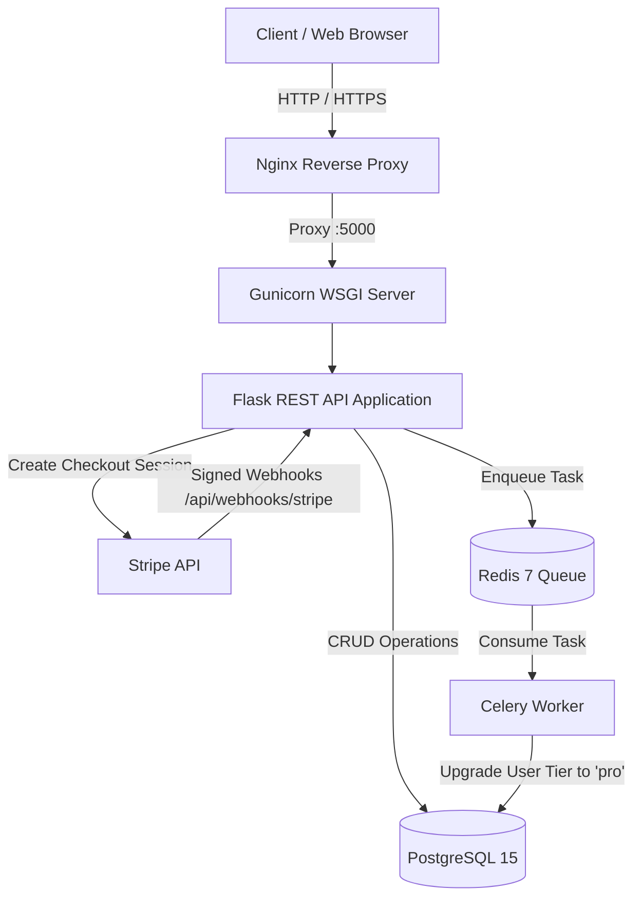
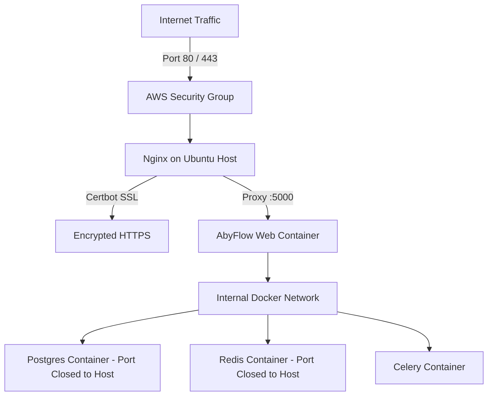

# AbyFlow API

[](tests/)
[](https://www.python.org/)
[](https://flask.palletsprojects.com/)
[](https://www.docker.com/)

**AbyFlow** is a resilient, asynchronous SaaS payment and user billing backend built with Flask, Celery, Redis, and PostgreSQL. It is designed to handle high-throughput Stripe payment webhooks with atomic idempotency and non-blocking background task execution.

> **Note on Payment Model:** AbyFlow currently implements **one-time payments** (`mode='payment'`) via Stripe Checkout for lifetime/fixed-tier access upgrades ($20.00 USD). It is technically structured to allow seamless extension to recurring subscriptions in future versions.

---

## Architecture Overview



### Component Breakdown
- **Web Application ([Flask](https://flask.palletsprojects.com/)):** Application factory pattern (`create_app`), modular blueprints for `auth`, `subscriptions`, and `webhooks`, and a comprehensive `/health` monitoring endpoint.
- **Task Queue ([Celery](https://docs.celeryq.dev/) + [Redis](https://redis.io/)):** Asynchronous payment fulfillment worker with automatic exponential backoff retries on transient failures.
- **Relational Storage ([PostgreSQL](https://www.postgresql.org/)):** User credential and plan tier storage, alongside a `processed_event` table enforcing database-level unique constraints for webhook idempotency.
- **Security & Auth:** Bcrypt password hashing, JWT access tokens with configurable expiration, input sanitization, and non-root Docker execution.
- **Payment Gateway ([Stripe](https://stripe.com/)):** Cryptographic webhook signature verification (`stripe.Webhook.construct_event`) and hosted checkout session creation.

---

## Project Structure

```
AbyFlow/
├── .dockerignore
├── .env.example                # Template for environment configuration
├── .gitignore
├── Dockerfile                  # Hardened, non-root Python 3.12 container
├── docker-compose.yml          # Local development stack (internal network isolation)
├── docker-compose.prod.yml     # Production stack (EC2 deployment ready)
├── requirements.txt            # Pinned dependencies
├── wsgi.py                     # Production WSGI application entry point
├── app/
│   ├── __init__.py             # Flask application factory with /health check
│   ├── config.py               # Development, Testing, Production config classes
│   ├── extensions.py           # Initialized extensions (SQLAlchemy, Bcrypt, JWT)
│   ├── extentions.py           # Backward-compatibility alias
│   ├── models.py               # SQLAlchemy models (User, ProcessedEvent)
│   ├── tasks.py                # Celery app and process_payment_task
│   ├── routes/
│   │   ├── auth.py             # /register, /login, /dashboard
│   │   ├── subscriptions.py    # /create-checkout, /success, /cancel
│   │   └── webhooks.py         # /stripe webhook handler with signature checks
│   ├── schemas/
│   │   └── stripe_schema.py    # Marshmallow webhook payload validation
│   └── services/
│       ├── stripe_service.py   # Stripe checkout session generator
│       └── user_service.py     # Idempotent tier upgrade/downgrade logic
├── nginx/
│   └── abyflow.conf            # Reverse proxy & SSL configuration for EC2
├── scripts/
│   └── init_db.py              # Automated database table initialization
└── tests/
    ├── conftest.py             # Isolated in-memory SQLite fixtures
    ├── test_auth.py            # Authentication & JWT test cases
    ├── test_health.py          # Health check & root endpoint tests
    ├── test_services.py        # Service & Celery execution tests
    └── test_stripe.py          # Stripe checkout & webhook signature test cases
```

---

## API Endpoints

### 1. System
| Method | Endpoint | Description | Auth Required |
|---|---|---|---|
| `GET` | `/` | API status and version metadata | No |
| `GET` | `/health` | Live health probe checking DB and Redis | No |

### 2. Authentication
| Method | Endpoint | Description | Auth Required |
|---|---|---|---|
| `POST` | `/api/auth/register` | Register new user with email & password | No |
| `POST` | `/api/auth/login` | Authenticate and obtain JWT access token | No |
| `GET` | `/api/auth/dashboard` | Access user profile and `plan_tier` | Bearer JWT |

### 3. Subscriptions & Payments
| Method | Endpoint | Description | Auth Required |
|---|---|---|---|
| `POST` | `/api/subscriptions/create-checkout` | Generate Stripe Checkout URL ($20 one-time) | Bearer JWT |
| `GET` | `/api/subscriptions/success` | Payment success callback landing page | No |
| `GET` | `/api/subscriptions/cancel` | Payment cancellation callback landing page | No |

### 4. Webhooks
| Method | Endpoint | Description | Auth Required |
|---|---|---|---|
| `POST` | `/api/webhooks/stripe` | Stripe signed webhook receiver | `Stripe-Signature` Header |

---

## Quickstart (Local Development with Docker)

### 1. Prerequisites
- [Docker](https://www.docker.com/) & Docker Compose
- [Stripe CLI](https://stripe.com/docs/stripe-cli) (optional, for real end-to-end webhook testing)

### 2. Configure Environment
Copy `.env.example` to `.env`:
```bash
cp .env.example .env
```
Fill in your Stripe test mode keys:
```env
FLASK_ENV=development
POSTGRES_USER=abyflow_user
POSTGRES_PASSWORD=abyflow_password
POSTGRES_DB=abyflow_db
DATABASE_URL=postgresql://abyflow_user:abyflow_password@db:5432/abyflow_db
REDIS_URL=redis://redis:6379/0
JWT_SECRET_KEY=dev_jwt_secret_key_change_me
STRIPE_PUBLISHABLE_KEY=pk_test_your_key
STRIPE_SECRET_KEY=sk_test_your_key
STRIPE_WEBHOOK_SECRET=whsec_your_key
APP_BASE_URL=http://localhost:5000
```

### 3. Build and Start Stack
```bash
docker compose up -d --build
```
This starts 4 isolated containers:
- `abyflow-db-1` (Postgres 15)
- `abyflow-redis-1` (Redis 7)
- `abyflow-web-1` (Gunicorn/Flask on port 5000)
- `abyflow-worker-1` (Celery background worker)

### 4. Verify Stack Health
```bash
curl http://localhost:5000/health
```
Expected output:
```json
{
  "database": "connected",
  "redis": "connected",
  "status": "healthy"
}
```

---

## Testing

AbyFlow includes a comprehensive automated test suite with **32 unit and integration tests** using Pytest and an isolated in-memory SQLite database. Tests do not require active network connections or live Stripe credentials.

### Run All Tests:
```bash
pytest -v
```

### Test Coverage Summary:
- **Auth (`test_auth.py`):** Registration, duplicate detection, email normalization/sanitization, password validation, login, invalid credentials, JWT expiration, and deleted-user dashboard security.
- **Stripe (`test_stripe.py`):** Protected checkout session creation, mock Stripe API errors, cryptographic webhook signature validation, spoofing rejection, duplicate event idempotency, unsupported event handling, and automatic downgrade on payment failure.
- **Services & Celery (`test_services.py`):** User tier transition idempotency, transactional rollbacks, and Celery task execution with backoff.
- **Health (`test_health.py`):** Root metadata and degraded health check conditions.

---

## End-to-End Stripe Verification with Stripe CLI

1. **Start the local Stripe CLI forwarder:**
   ```bash
   stripe listen --forward-to localhost:5000/api/webhooks/stripe
   ```
2. Note the generated webhook signing secret (`whsec_...`) and place it in your `.env` as `STRIPE_WEBHOOK_SECRET`.
3. **Register & Log in:**
   ```bash
   # Register
   curl -X POST http://localhost:5000/api/auth/register \
     -H "Content-Type: application/json" \
     -d '{"email":"testuser@example.com","password":"Password123!"}'

   # Login
   curl -X POST http://localhost:5000/api/auth/login \
     -H "Content-Type: application/json" \
     -d '{"email":"testuser@example.com","password":"Password123!"}'
   ```
4. **Create Checkout Session:**
   ```bash
   curl -X POST http://localhost:5000/api/subscriptions/create-checkout \
     -H "Authorization: Bearer YOUR_JWT_TOKEN"
   ```
5. Open the returned `checkout_url` in your browser and complete the payment with Stripe test card `4242 4242 4242 4242`.
6. Inspect Celery worker logs:
   ```bash
   docker compose logs --tail=20 worker
   ```
7. Verify updated plan tier:
   ```bash
   curl -X GET http://localhost:5000/api/auth/dashboard \
     -H "Authorization: Bearer YOUR_JWT_TOKEN"
   ```
   Output: `"plan_tier": "pro"`

---

## AWS EC2 Production Deployment Guide

AbyFlow is optimized for ultra-low-cost deployment on a single **Ubuntu 24.04 LTS EC2 Instance** (e.g., `t3.micro` or `t4g.small` eligible under the AWS Free Tier).



### Step 1: Launch EC2 Instance
1. AMI: **Ubuntu Server 24.04 LTS (HVM)**
2. Instance Type: **t3.micro** (1 vCPU, 1 GB RAM) or **t4g.small**
3. Storage: 20 GB gp3 root volume
4. Configure Security Group:
   - **SSH (Port 22):** Restrict to your IP address.
   - **HTTP (Port 80):** Open to `0.0.0.0/0`.
   - **HTTPS (Port 443):** Open to `0.0.0.0/0`.
   - **DO NOT** open ports 5000, 5432, or 6379 to the public internet.

### Step 2: Install Docker and Nginx on Ubuntu
SSH into your EC2 instance:
```bash
sudo apt update && sudo apt upgrade -y
sudo apt install -y docker.io docker-compose-v2 nginx certbot python3-certbot-nginx git
sudo systemctl enable --now docker
sudo usermod -aG docker ubuntu
```
*(Log out and log back in for docker group permissions to take effect)*

### Step 3: Clone Repository and Configure Production Environment
```bash
git clone https://github.com/adithyaabhiram-28/AbyFlow.git
cd AbyFlow
cp .env.example .env
nano .env
```

Set production values in `.env`:
```env
FLASK_ENV=production
POSTGRES_USER=abyflow_prod_user
POSTGRES_PASSWORD=GENERATE_A_STRONG_RANDOM_PASSWORD
POSTGRES_DB=abyflow_prod_db
DATABASE_URL=postgresql://abyflow_prod_user:GENERATE_A_STRONG_RANDOM_PASSWORD@db:5432/abyflow_prod_db
REDIS_URL=redis://redis:6379/0
JWT_SECRET_KEY=GENERATE_A_64_CHAR_HEX_KEY
STRIPE_PUBLISHABLE_KEY=pk_live_your_key_or_test_key
STRIPE_SECRET_KEY=sk_live_your_key_or_test_key
STRIPE_WEBHOOK_SECRET=whsec_your_production_secret
APP_BASE_URL=https://yourdomain.com
```

### Step 4: Start Production Containers
```bash
docker compose -f docker-compose.prod.yml up -d --build
```
Initialize database tables:
```bash
docker compose -f docker-compose.prod.yml exec web python scripts/init_db.py
```

### Step 5: Configure Nginx & Obtain Free Let's Encrypt SSL
1. Copy the Nginx configuration:
   ```bash
   sudo cp nginx/abyflow.conf /etc/nginx/sites-available/abyflow.conf
   sudo sed -i 's/YOUR_DOMAIN_OR_EC2_PUBLIC_IP/yourdomain.com/g' /etc/nginx/sites-available/abyflow.conf
   sudo ln -s /etc/nginx/sites-available/abyflow.conf /etc/nginx/sites-enabled/
   sudo rm -f /etc/nginx/sites-enabled/default
   sudo nginx -t
   sudo systemctl reload nginx
   ```
2. Obtain free SSL certificate with Certbot:
   ```bash
   sudo certbot --nginx -d yourdomain.com
   ```
3. Set up Stripe Production Webhook Destination:
   - In your Stripe Dashboard, configure the webhook endpoint URL to:  
     `https://yourdomain.com/api/webhooks/stripe`
   - Select events: `checkout.session.completed`, `invoice.payment_failed`.

---

## AWS Cost Breakdown & Cleanup

### Estimated Monthly Cost (Free Tier Eligible):
- **EC2 `t3.micro`:** $0.00 / month (first 12 months with AWS Free Tier; ~$7.50/month thereafter).
- **EBS Storage (20 GB gp3):** $0.00 / month (under 30 GB Free Tier allowance).
- **PostgreSQL / Redis / Celery:** $0.00 (running as self-hosted containers on the same EC2 instance).
- **Let's Encrypt SSL:** Free forever.

### Decommissioning / Stopping Charges:
To completely terminate billing:
1. In AWS EC2 Console, select the instance and choose **Instance State → Terminate**.
2. Release any allocated **Elastic IP** under Network & Security.

---

## Security Hardening Highlights

1. **Zero Secret Leakage:** No keys, tokens, or raw payloads are ever output to logs or exception responses.
2. **Container Security:** Application containers execute under a non-root `appuser` (UID 1000).
3. **Database & Cache Isolation:** PostgreSQL and Redis ports are bound strictly to internal Docker bridge networks with no external exposure.
4. **Cryptographic Webhook Verification:** All Stripe webhook requests require valid signatures computed against raw payloads before any deserialization or dispatch.
5. **Atomic Idempotency:** Webhook event IDs are guarded by database-level unique constraints with rollback handling to prevent duplicate task execution.
6. **JWT Expiration:** Configurable token expiration (default: 24 hours).
